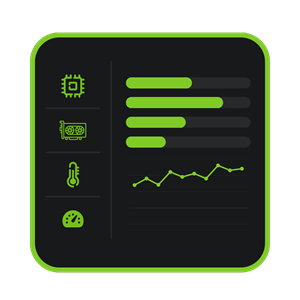
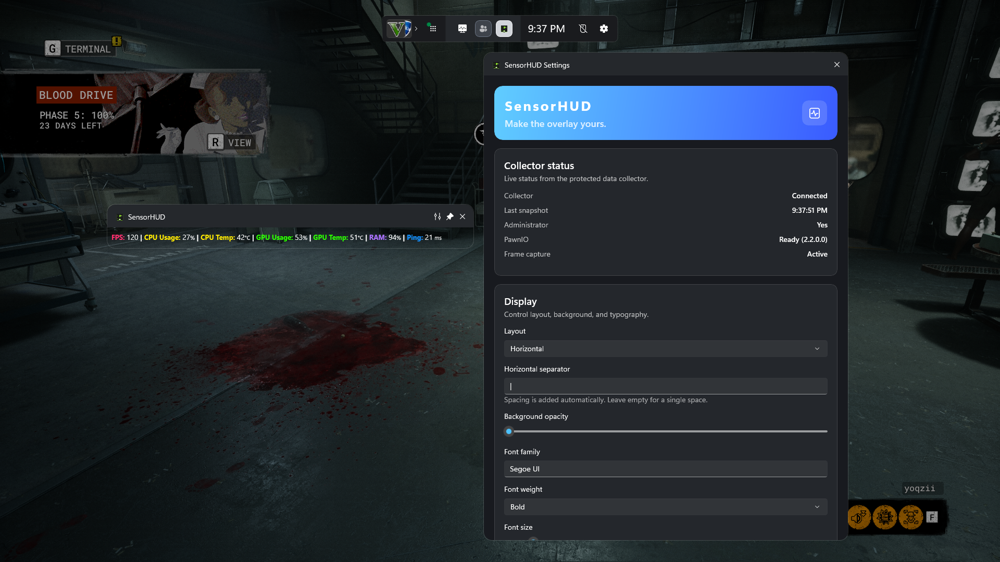
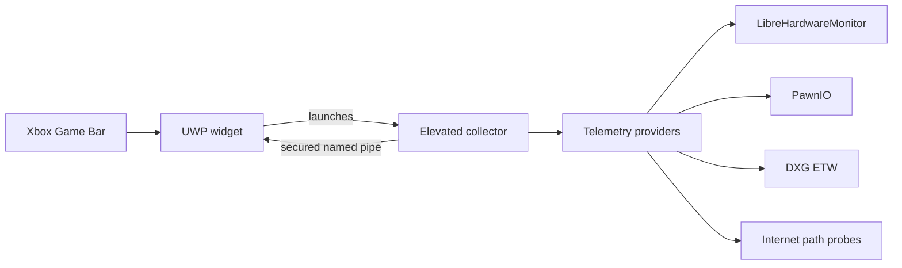

<div align="center">
  

  <h1>SensorHUD</h1>

  <p>
    Fast, customizable PC telemetry inside Xbox Game Bar.
  </p>

  <p>
    <a href="../../releases/latest">
      
    </a>
    
    
    <a href="LICENSE">
      
    </a>
  </p>

  <p>
    <a href="#getting-started">Get started</a>
    ·
    <a href="#using-sensorhud">Usage</a>
    ·
    <a href="#metrics">Metrics</a>
    ·
    <a href="#documentation">Documentation</a>
  </p>
</div>

---

SensorHUD keeps live system information visible over a game without requiring
you to leave the Game Bar overlay. It is designed to remain compact,
responsive, and easy to customize.



| Live telemetry | Flexible presentation | Local by design |
| --- | --- | --- |
| CPU, GPU, memory, network, and frame-performance readings | Per-metric visibility, formats, decimals, layout, colors, and typography | No account, advertising, analytics, cloud service, or developer telemetry |

> [!NOTE]
> Available readings depend on the sensors exposed by the computer's hardware,
> firmware, and drivers.

## Contents

- [Getting started](#getting-started)
  - [Requirements](#requirements)
  - [Install](#install)
  - [Update](#update)
  - [Uninstall](#uninstall)
- [Using SensorHUD](#using-sensorhud)
  - [Customize the overlay](#customize-the-overlay)
  - [Format a metric](#format-a-metric)
- [Metrics](#metrics)
  - [Internet ping and packet loss](#internet-ping-and-packet-loss)
- [Troubleshooting](#troubleshooting)
- [Architecture and performance](#architecture-and-performance)
- [Documentation](#documentation)
- [Building from source](#building-from-source)
- [Third-party software](#third-party-software)
- [License](#license)

## Getting started

### Requirements

- 64-bit Windows 10 build 18362 or later on an Intel or AMD processor
- An up-to-date installation of Xbox Game Bar
- An administrator account or access to administrator credentials
- Developer Mode enabled for sideloading

### Install

1. Open the [latest GitHub release](../../releases/latest).
2. Download `SensorHUD-<version>-x64.zip`.
3. Extract the complete archive to a normal folder.
4. Double-click `Install.cmd`.
5. Accept the administrator prompt used to trust the `yoqzii` release
   certificate.
6. Press <kbd>Win</kbd> + <kbd>G</kbd>, open the widget menu, and select
   **SensorHUD**.
7. Accept the **SensorHUD Data Collector** elevation prompt.

> [!IMPORTANT]
> Install SensorHUD only from this repository. The installer verifies that
> the MSIX package matches the included public certificate before changing
> certificate trust or installing the package.

The certificate is necessary because the signed MSIX is distributed directly
through GitHub. The installer adds only the public `yoqzii` certificate to the
Local Machine **Trusted People** store. It does not enable Developer Mode or
change the system-wide PowerShell execution policy.

On first use, the collector may install PawnIO 2.2.0. PawnIO provides the
signed low-level driver used by supported hardware sensors. Later launches
reinstall it only if it is missing, damaged, or older than the required
version.

### Update

Download and extract the new release, then run its `Install.cmd`. Windows
replaces the package while preserving SensorHUD's local settings.

SensorHUD supports only its current settings schema. An invalid or
incompatible settings file resets safely to the current defaults.

### Uninstall

Run `Uninstall.cmd` from the extracted release folder. It removes the
application package and its trusted release certificate.

PawnIO is installed system-wide and may be shared with other monitoring
software, so SensorHUD leaves it installed. If it is no longer needed, remove
**PawnIO** separately from **Windows Settings > Apps > Installed apps**.

## Using SensorHUD

1. Press <kbd>Win</kbd> + <kbd>G</kbd>.
2. Open **SensorHUD** from the Game Bar widget menu.
3. Move and resize the telemetry widget as needed.
4. Select the pin button to keep it visible after closing Game Bar.
5. Select the widget's settings button to open **SensorHUD Settings**.

The settings page also shows collector health, PawnIO availability, frame
capture state, detected hardware, the latest snapshot time, and the most
recent connection error.

### Customize the overlay

Settings are saved automatically. You can:

- Show or hide each metric.
- Choose vertical or horizontal layout.
- Change the horizontal separator.
- Select the font family, weight, size, and color.
- Adjust background opacity.
- Set a format and decimal places independently for every metric.
- Configure each detected GPU independently.

Use **Reset settings** at the bottom of the settings widget to restore current
defaults.

### Format a metric

Every metric format can contain these tokens:

| Token | Output |
| --- | --- |
| `{name}` | Metric name |
| `{value}` | Numeric reading |
| `{unit}` | Unit such as `%`, `GB`, or `ms` |
| `{device}` | Detected device name, or the category name as a fallback |

For example:

```text
{device} Temp: {value}{unit}
```

can render as:

```text
NVIDIA GeForce RTX 4080 Temp: 64°C
```

Each metric can use its default decimal count or zero, one, or two decimal
places. The value is rendered slightly larger than its unit for quick
scanning.

## Metrics

| Category | Available metrics |
| --- | --- |
| **Frame Rate** | FPS, 1% Low, and average frametime for the selected presenting foreground process |
| **CPU** | Total load and package temperature |
| **GPU** | Load, temperature, VRAM usage, VRAM used, and VRAM total for every detected adapter |
| **Memory** | Physical-memory usage, memory used, and memory total |
| **Network** | Upload and download throughput, Internet ping, and packet loss |

Every GPU is treated as an independent device. SensorHUD creates a separate
settings card and saved preferences for each adapter detected by
LibreHardwareMonitor.

### Internet ping and packet loss

Ping and packet loss measure general Internet-path stability, not a game
server or the foreground process.

The collector selects between Cloudflare
[`1.1.1.1`](https://developers.cloudflare.com/1.1.1.1/ip-addresses/) and
Google Public DNS
[`8.8.8.8`](https://developers.google.com/speed/public-dns/docs/using), then
sends one asynchronous ICMP probe per one-second sampling interval to the
selected endpoint. It keeps a bounded rolling window of 20 attempts:

- **Ping** is the average round-trip time of successful replies.
- **Packet Loss** is the percentage of failed attempts.
- After three consecutive failures, both endpoints are tested again.

Some networks block ICMP while allowing normal Internet traffic. In that
case, these metrics can be unavailable even though browsing and games still
work.

## Troubleshooting

| Symptom | What to check |
| --- | --- |
| A temperature or hardware metric is unavailable | Confirm that the hardware, firmware, and driver expose the corresponding sensor |
| FPS remains unavailable | Reopen SensorHUD, accept the collector elevation prompt, and ensure a foreground application is presenting frames |
| Ping and packet loss are unavailable | The network or router may block ICMP; ordinary Internet traffic can still work |
| A GPU is missing | Check whether LibreHardwareMonitor detects that adapter |
| The widget shows no telemetry | Open SensorHUD Settings and review collector state and the latest connection error |
| Settings appear invalid after an update | Use **Reset settings**; SensorHUD intentionally supports only the current schema |

## Architecture and performance



| Project | Responsibility |
| --- | --- |
| `SensorHUD` | Packaged UWP frontend: widget lifecycle, settings, presentation, and collector reconnection |
| `SensorHUD.Collector` | Elevated, windowless backend: PawnIO, LibreHardwareMonitor, ETW, sampling, and pipe server |
| `SensorHUD.Core` | Shared metric registry, settings model, telemetry contracts, protocol envelope, and JSON metadata |

The privileged collector is isolated from the widget. Communication uses a
package-scoped named pipe with client identity verification and a strict,
size-limited, length-prefixed protocol.

Recurring work is intentionally bounded:

- Hardware uses one shared update and enumeration pass.
- DXG ETW is filtered to frame-presentation events.
- Frame and Internet histories use fixed windows.
- The pipe keeps only the newest pending snapshot.
- The widget reuses existing XAML elements when structure is unchanged.
- A failed provider does not suppress independent metrics.

Settings use the current schema without a legacy migration layer. Unknown
properties or invalid values fall back safely to current defaults.

## Documentation

| Document | Purpose |
| --- | --- |
| [Extending SensorHUD](docs/EXTENDING.md) | Add metrics, categories, per-device readings, providers, or global settings |
| [Privacy policy](PRIVACY) | Local data handling and Internet stability probes |
| [Third-party notices](THIRD-PARTY-NOTICES) | Dependency licenses and source information |

The extension guide explains the complete metadata model, including category
names and descriptions, format tokens, decimal defaults, sort order,
global/per-device/mixed categories, stable device identities, provider
ownership, and validation.

## Building from source

### Development requirements

- Visual Studio with MSBuild, UWP, MSIX packaging, and C++ x64 build tools
- .NET 10 SDK
- Windows SDK 10.0.26100
- Xbox Game Bar

Open `SensorHUD.slnx`, select the `x64` platform, and build the solution.

See [Extending SensorHUD](docs/EXTENDING.md#validate-the-change) for the
recommended validation checklist.

## Third-party software

SensorHUD uses:

- [PawnIO](https://github.com/namazso/PawnIO)
- [LibreHardwareMonitor](https://github.com/LibreHardwareMonitor/LibreHardwareMonitor)
- [Microsoft TraceEvent](https://github.com/microsoft/perfview)
- Microsoft Gaming Xbox Game Bar SDK
- [C#/WinRT](https://github.com/microsoft/CsWinRT)

Licenses and source information are documented in
[THIRD-PARTY-NOTICES](THIRD-PARTY-NOTICES). PawnIO's license text and
corresponding source archives are included in both the repository and release
package.

## License

Copyright © 2026 yoqzii.

SensorHUD is released under the [MIT License](LICENSE).
