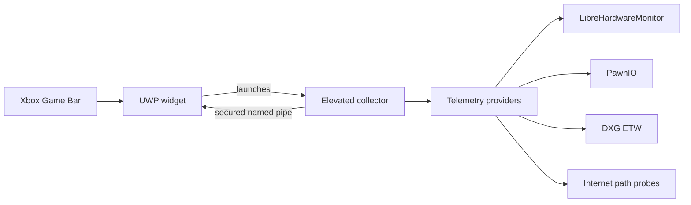

<div align="center">
  

  <h1>SensorHUD</h1>

  <p>
    A fast, customizable PC telemetry widget built for Xbox Game Bar.
  </p>

  <p>
    
    
    
    <a href="LICENSE">
      
    </a>
  </p>

  <p>
    <a href="#installation">Installation</a>
    -
    <a href="#what-it-monitors">Metrics</a>
    -
    <a href="#how-it-works">Architecture</a>
    -
    <a href="#building-from-source">Build</a>
    -
    <a href="#privacy">Privacy</a>
  </p>
</div>

---

*I might not be very active for development in the future.*

---

SensorHUD puts live system information inside the Game Bar overlay,
where it remains visible without switching away from a game. The widget is
designed to be compact, responsive, and useful at a glance.


| Live telemetry | Flexible presentation | Local by design |
| --- | --- | --- |
| CPU, GPU, memory, network, frame rate, temperatures, load, and dedicated memory | Configurable metrics, formats, decimals, layout, colors, typography, and pinning | No account, advertising, analytics, cloud service, or remote telemetry |

> [!NOTE]
> Available readings depend on the sensors exposed by the computer's hardware,
> firmware, and drivers.

## Installation

### Requirements

- 64-bit Windows 10 build 18362 or later on an Intel or AMD processor
- An up-to-date installation of Xbox Game Bar
- An administrator account or access to administrator credentials
- Developer mode enabled for sideloading

### Install

1. Open the [latest GitHub release](../../releases/latest).
2. Download the `SensorHUD-<version>-x64.zip` archive.
3. Extract the entire ZIP to a normal folder.
4. Double-click `Install.cmd`.
5. Accept the administrator prompt used to trust the `yoqzii` release
   certificate.
6. Press <kbd>Win</kbd> + <kbd>G</kbd>, open the widget menu, and select
   **SensorHUD**.
7. Accept the **SensorHUD Data Collector** elevation prompt.

> [!IMPORTANT]
> Install the application only from this repository. The installer confirms
> that the MSIX package matches the included public certificate before it
> changes certificate trust or installs the package.

The certificate is required because the signed MSIX is distributed directly
through GitHub. The installer adds only the public `yoqzii` certificate to the
Local Machine **Trusted People** store. It does not enable Developer Mode or
change the system-wide PowerShell execution policy.

On first use, the collector may install PawnIO 2.2.0. PawnIO supplies the
signed low-level driver used by supported hardware sensors. Future launches
verify the installation and reinstall it only when it is missing, damaged, or
older than the required version.

## Updating

Download and extract the new release, then run its `Install.cmd`. Windows
replaces the installed package while preserving the application's local
settings file. SensorHUD accepts only the current settings schema and resets
invalid or incompatible files to defaults.

## Uninstallation

Run `Uninstall.cmd` from the extracted release folder. It removes the
application package and its trusted release certificate.

PawnIO is installed system-wide and may be shared with other monitoring
software, so it is left in place. If it is no longer needed, remove **PawnIO**
separately from **Windows Settings > Apps > Installed apps**.

## What it monitors

| Category | Available metrics |
| --- | --- |
| CPU | Total load and package temperature |
| GPU | Load, temperature, dedicated-memory usage, memory used, and memory total for every detected adapter |
| Memory | Physical-memory usage, memory used, and memory total |
| Network | Upload and download throughput, Internet ping, and packet loss |
| Frame Rate | FPS, 1% Low, and average frametime for the selected presenting foreground process |

Ping and packet loss measure general Internet-path stability rather than a
specific game or foreground process. The collector asynchronously probes a
selected public anycast endpoint once per sampling interval and keeps a
bounded rolling window. Cloudflare
[`1.1.1.1`](https://developers.cloudflare.com/1.1.1.1/ip-addresses/) and
Google Public DNS
[`8.8.8.8`](https://developers.google.com/speed/public-dns/docs/using) are
used for initial selection and automatic failover; ordinary sampling probes
only the selected endpoint. These readings can be unavailable when a network
blocks ICMP even though other Internet traffic still works.

Every individual metric can be enabled or hidden. Formats support
`{value}`, `{unit}`, `{name}`, and `{device}`, and each metric can use its
catalog default or zero, one, or two decimal places. The rendered value is
slightly larger while the unit remains compact. The font-weight setting
applies to labels and device names; `{value}` and `{unit}` remain normal
weight for readability. Horizontal layout uses `|` as its default separator,
and the separator can be changed in settings.

The settings widget also reports collector health, PawnIO availability, frame
capture state, detected hardware, the most recent snapshot time, and the
latest connection error when troubleshooting is needed.

## How it works



| Project | Responsibility |
| --- | --- |
| `SensorHUD` | Packaged UWP frontend hosted by Xbox Game Bar. It owns widget lifecycle, settings, presentation, and the reconnecting collector connection; it has no direct low-level hardware access. |
| `SensorHUD.Collector` | Same-package, elevated and windowless backend. It owns PawnIO readiness, LibreHardwareMonitor, ETW capture, sampling, and the secured pipe server. |
| `SensorHUD.Core` | Platform-independent metric registry, settings model, telemetry contracts, versioned protocol envelope, and source-generated JSON metadata shared by both processes. |

The privileged collector is isolated from the widget. Communication crosses a
package-scoped named pipe whose client identity is verified before telemetry
is exchanged. The pipe has a strict size-limited, length-prefixed protocol.
Session identity exists only in the message envelope, while telemetry
snapshots contain capture time, typed health, and readings.

Recurring work is intentionally bounded: hardware uses one shared update
pass, DXG ETW is filtered to presentation events, frame and Internet histories
have fixed windows, the pipe keeps only the newest pending snapshot, and the
widget updates existing XAML runs when its structure has not changed. Provider
failures are isolated so one unavailable source does not suppress independent
metrics.

The settings file also uses only the current schema. There is no legacy
migration layer; unknown properties or invalid values cause a clean fallback
to current defaults.

### Extending SensorHUD

Adding telemetry has two independent parts:

1. Describe the category and metric in
   `SensorHUD.Core/Metrics/MetricRegistry.cs`.
2. Publish a `MetricReading` from a collector reader or provider.

That is all the settings UI needs. Category cards, category descriptions,
metric names, format editors, decimal choices, device-specific editors,
ordering, defaults, and overlay formatting are generated from the registry.
Do not add category-specific settings XAML.

#### Category metadata

Every category has one `MetricCategoryDefinition`:

| Property | Purpose |
| --- | --- |
| `Id` | Strongly typed category identity used by metric definitions |
| `Name` | Heading displayed in settings |
| `Description` | Optional text displayed directly below the heading; use `null` to omit it |
| `SortOrder` | Unique category position; lower values appear first |

For example:

```csharp
new()
{
    Id = MetricCategory.Cpu,
    Name = "CPU",
    Description = "Processor utilization and temperature.",
    SortOrder = 100,
},
```

#### Metric metadata

Every metric has one readable `MetricDefinition`:

| Property | Required | Purpose |
| --- | --- | --- |
| `Id` | Yes | Stable provider and settings identity |
| `Category` | Yes | Category containing the metric |
| `Name` | Yes | Name in settings and value of `{name}` |
| `Unit` | Yes | Value of `{unit}`; use an empty string for no unit |
| `Format` | Yes | Default overlay format |
| `Decimals` | Yes | Default number of decimal places |
| `SortOrder` | Yes | Unique position inside the category |
| `IsVisibleByDefault` | No | Defaults to `true` |
| `IsPerDevice` | No | Defaults to `false`; enable it for one independent metric per device |

Metric formats support four tokens:

| Token | Replaced with |
| --- | --- |
| `{name}` | Metric `Name` |
| `{value}` | Numeric reading using the selected decimals |
| `{unit}` | Metric `Unit` |
| `{device}` | Provider-supplied device name, or the category name as a fallback |

The settings widget automatically provides **Default**, **0 decimals**,
**1 decimal**, and **2 decimals** choices. The shared range is defined by
`MinimumDecimals` and `MaximumDecimals` in `SettingsDefaults`.

#### Add a global metric to an existing category

First add a stable ID near the top of `MetricRegistry`, then add its
definition to `OrderedDefinitions`:

```csharp
public const string CpuPower = "cpu.power";

new()
{
    Id = CpuPower,
    Category = MetricCategory.Cpu,
    Name = "Power",
    Unit = "W",
    Format = "{device} Power: {value} {unit}",
    Decimals = 1,
    IsVisibleByDefault = false,
    SortOrder = 2,
},
```

Then publish the reading from the category's existing reader or provider:

```csharp
readings.Add(new MetricReading
{
    MetricId = MetricRegistry.CpuPower,
    DeviceName = "CPU",
    Value = watts,
});
```

The CPU category and its new metric editor appear automatically. No settings
view model or XAML change is required.

#### Add a per-device metric to an existing category

Use the same definition, but set `IsPerDevice = true`:

```csharp
public const string GpuFanSpeed = "gpu.fanSpeed";

new()
{
    Id = GpuFanSpeed,
    Category = MetricCategory.Gpu,
    Name = "Fan Speed",
    Unit = "RPM",
    Format = "{device} Fan: {value} {unit}",
    Decimals = 0,
    SortOrder = 5,
    IsPerDevice = true,
},
```

Every published reading must include both device fields:

```csharp
readings.Add(new MetricReading
{
    MetricId = MetricRegistry.GpuFanSpeed,
    DeviceId = stableDeviceId,
    DeviceName = gpu.Name,
    Value = fanRpm,
});
```

`DeviceId` is the durable settings identity and must remain stable across
samples and restarts. `DeviceName` is only the user-facing label. SensorHUD
creates one `GPU - <device name>` category card and one saved preference per
detected device. A per-device card appears after the collector has published
at least one reading carrying that device ID. LibreHardwareMonitor readers
should use `SensorLookup.StableDeviceId` rather than inventing another device
identity scheme.

#### Add a new category

First add its enum member in
`SensorHUD.Core/Metrics/MetricDefinition.cs`:

```csharp
public enum MetricCategory
{
    // Existing categories...
    Storage,
}
```

Then add its category metadata to `CategoryDefinitions` in `MetricRegistry`:

```csharp
new()
{
    Id = MetricCategory.Storage,
    Name = "Storage",
    Description = "Drive activity, capacity, and health.",
    SortOrder = 500,
},
```

Finally add one or more metric definitions assigned to
`MetricCategory.Storage` and publish their readings. The new category is now
complete; there are no label switches, order switches, settings view models,
or XAML templates to update.

#### Choose global, per-device, or mixed behavior

Behavior is selected per metric, not per category:

- **Global category:** leave `IsPerDevice` false on every metric. Settings
  shows one category card.
- **Per-device category:** set `IsPerDevice = true` on every metric. Settings
  shows one category card per detected device.
- **Mixed category:** combine global and per-device definitions in the same
  category. Settings shows one global category card plus one card for each
  detected device.

For example, a Storage category could expose global `Total Activity` while
also exposing per-device `Temperature`. No special mixed-category code is
needed.

| Storage metric | `IsPerDevice` | Generated settings card |
| --- | --- | --- |
| `Total Activity` | `false` | `Storage` |
| `Temperature` | `true` | `Storage - <device name>` for every drive |

Expected unavailable data should still be published with the metric ID,
device identity when applicable, a null `Value`, and an explanatory `Error`.
Provider exceptions are reserved for unexpected failures.

#### Add a telemetry provider

1. Create a focused `ITelemetryProvider` under
   `SensorHUD.Collector/Sampling`.
2. Keep `Sample` short and non-blocking. Long-running I/O should execute in
   the background and expose the latest bounded result to `Sample`.
3. Return unavailable readings for expected startup, permission, hardware, or
   connectivity states. An unexpected exception is isolated and reported as
   collector health without suppressing other providers.
4. Implement `IDisposable` when the provider owns ETW sessions, timers,
   hardware handles, or background resources.
5. Construct and register the provider in
   `TelemetrySampler.CreateDefault`.

When a new reading comes from the existing LibreHardwareMonitor `Computer`,
prefer a focused reader called by `HardwareMetricsProvider`. This preserves
one hardware enumeration/update pass instead of opening another monitor.
Readers remain the sole owners of their metrics, so do not duplicate fallback
metric lists in the provider. Sources that do not require
LibreHardwareMonitor, such as Windows physical-memory status, should remain
independent of its startup state.

Keep existing metric IDs and per-device IDs unchanged after release. They are
durable settings identities. Category enum values are not persisted.

#### Add a global setting

1. Add the model value, default, and validation rule under
   `SensorHUD.Core/Settings`.
2. Expose it through the focused layout or appearance view model.
3. Add its compiled `x:Bind` control to `SettingsWidgetPage.xaml`.

After any extension, build the complete `Debug|x64` solution with Visual
Studio MSBuild so XAML generation is validated, and build the collector in
Release configuration to catch backend-specific warnings.

## Privacy

Hardware readings, device names, and preferences remain on the local computer.
The application has no server component and does not transmit collected
telemetry to the developer or any third party. Its small Internet stability
probes are described in the privacy policy.

Read the complete [privacy policy](PRIVACY).

## Building from source

### Development requirements

- Visual Studio with MSBuild, UWP, MSIX packaging, and C++ x64 build tools
- .NET 10 SDK
- Windows SDK 10.0.26100
- Xbox Game Bar

Open `SensorHUD.slnx`, select the `x64` platform, and build the
solution.

## Third-party software

SensorHUD uses:

- [PawnIO](https://github.com/namazso/PawnIO)
- [LibreHardwareMonitor](https://github.com/LibreHardwareMonitor/LibreHardwareMonitor)
- [Microsoft TraceEvent](https://github.com/microsoft/perfview)
- Microsoft Gaming Xbox Game Bar SDK
- [C#/WinRT](https://github.com/microsoft/CsWinRT)

Licenses and source information are documented in
[THIRD-PARTY-NOTICES](THIRD-PARTY-NOTICES). PawnIO's license text and
corresponding source archives are included in both the repository and the
release package.

## License

Copyright © 2026 yoqzii.

SensorHUD is released under the [MIT License](LICENSE).
