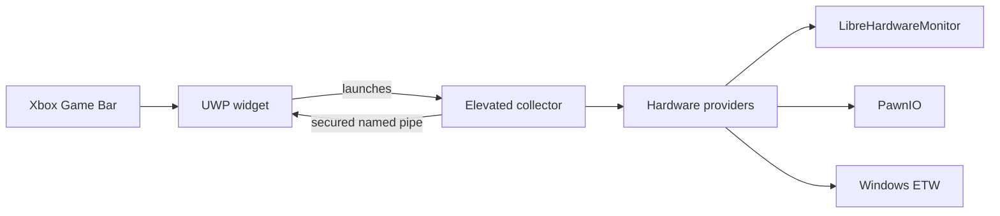

  

  <h1>SensorHUD</h1>

  

    A fast, customizable PC telemetry widget built for Xbox Game Bar.
  

  

    
    
    
    
  

  

    <a href="#installation">Installation</a>
    ·
    <a href="#what-it-monitors">Metrics</a>
    ·
    <a href="#how-it-works">Architecture</a>
    ·
    <a href="#building-from-source">Build</a>
    ·
    <a href="#privacy">Privacy</a>
  

---

SensorHUD puts live system information inside the Game Bar overlay,
where it remains visible without switching away from a game. The widget is
designed to be compact, responsive, and useful at a glance.

| Live telemetry | Flexible presentation | Local by design |
| --- | --- | --- |
| CPU, GPU, memory, network, frame rate, temperatures, load, and dedicated memory | Configurable metrics, templates, decimal precision, layout, colors, typography, and pinning | No account, advertising, analytics, cloud service, or remote telemetry |

> [!NOTE]
> Available readings depend on the sensors exposed by the computer's hardware,
> firmware, and drivers.

## Installation

### Requirements

- 64-bit Windows 10 build 18362 or later on an Intel or AMD processor
- An up-to-date installation of Xbox Game Bar
- An administrator account or access to administrator credentials

### Install

1. Open the [latest GitHub release](../../releases/latest).
2. Download the `SensorHUD-<version>-x64.zip` archive.
3. Extract the entire ZIP to a normal folder.
4. Double-click `Install.cmd`.
5. Accept the administrator prompt used to trust the `yoqzii` release
   certificate.
6. Press <kbd>Win</kbd> + <kbd>G</kbd>, open the widget menu, and select
   **SensorHUD**.
7. Accept the **SensorHUD Data Collector** elevation prompt.

> [!IMPORTANT]
> Install the application only from this repository. The installer confirms
> that the MSIX package matches the included public certificate before it
> changes certificate trust or installs the package.

The certificate is required because the signed MSIX is distributed directly
through GitHub. The installer adds only the public `yoqzii` certificate to the
Local Machine **Trusted People** store. It does not enable Developer Mode or
change the system-wide PowerShell execution policy.

On first use, the collector may install PawnIO 2.2.0. PawnIO supplies the
signed low-level driver used by supported hardware sensors. Future launches
verify the installation and reinstall it only when it is missing, damaged, or
older than the required version.

## Updating

Download and extract the new release, then run its `Install.cmd`. Windows
replaces the installed package while preserving the application's local
settings.

## Uninstallation

Run `Uninstall.cmd` from the extracted release folder. It removes the
application package and its trusted release certificate.

PawnIO is installed system-wide and may be shared with other monitoring
software, so it is left in place. If it is no longer needed, remove **PawnIO**
separately from **Windows Settings > Apps > Installed apps**.

## What it monitors

| Category | Available metrics |
| --- | --- |
| Processor | Total load and package temperature |
| Graphics | Load, temperature, dedicated-memory usage, memory used, and memory total for every detected GPU |
| Memory | Physical-memory usage, memory used, and memory total |
| Network | Upload and download throughput |
| Games | FPS, 1% Low, and average frametime when a compatible ETW source is available |

Every individual metric can be enabled or hidden. Templates support
`{value}`, `{unit}`, `{name}`, and `{device}`, and each metric can use its
catalog default or zero, one, or two decimal places. The rendered value is
slightly larger while the unit remains compact. The font-weight setting
applies to labels and device names; `{value}` and `{unit}` remain normal
weight for readability. Horizontal layout uses `|` as its default separator,
and the separator can be changed in settings.

The settings widget also reports collector health, PawnIO availability, frame
capture state, detected hardware, the most recent snapshot time, and the
latest connection error when troubleshooting is needed.

## How it works

| Project | Responsibility |
| --- | --- |
| `SensorHUD` | Packaged UWP frontend hosted by Xbox Game Bar. It owns widget lifecycle, settings, presentation, and the reconnecting collector connection; it has no direct low-level hardware access. |
| `SensorHUD.Collector` | Same-package, elevated and windowless backend. It owns PawnIO readiness, LibreHardwareMonitor, ETW capture, sampling, and the secured pipe server. |
| `SensorHUD.Core` | Platform-independent metric registry, settings model, telemetry contracts, versioned protocol envelope, and source-generated JSON metadata shared by both processes. |

The privileged collector is isolated from the widget. Communication crosses a
package-scoped named pipe whose client identity is verified before telemetry
is exchanged. The pipe has a strict size-limited, length-prefixed protocol.
Session identity exists only in the message envelope, while telemetry
snapshots contain capture time, typed health, and readings.

The current protocol starts at version 1. The project was unpublished when
this architecture was introduced, so there is no earlier protocol fallback,
settings migration, deprecated alias, or compatibility adapter. An
incompatible local settings file falls back to defaults and is replaced by
the next automatic save.

### Extending SensorHUD

Metric metadata is declarative and centralized in
`SensorHUD.Core/Metrics/MetricRegistry.cs`. A provider publishes only a base
metric ID, optional device identity and name, numeric value, and error.
Per-device preferences use the centralized `<metricId>@<deviceId>` key format.

To add a metric:

1. Add one definition to `MetricRegistry`.
2. Publish one reading with that base ID from the appropriate collector
   reader.

Settings grouping and telemetry rendering then adapt automatically.

To add a global setting:

1. Add the model value, default, and validation rule under
   `SensorHUD.Core/Settings`.
2. Expose it through the focused layout or appearance view model.
3. Add its compiled `x:Bind` control to `SettingsWidgetPage.xaml`.

To add a new hardware source, implement `ITelemetryProvider` and register it
in `TelemetrySampler.CreateDefault`. Provider failures are isolated so one
source cannot suppress independent readings.

## Privacy

Hardware readings, device names, and preferences remain on the local computer.
The application has no server component and does not transmit information to
the developer or any third party.

Read the complete [privacy policy](PRIVACY).

## Building from source

### Development requirements

- Visual Studio with MSBuild, UWP, MSIX packaging, and C++ x64 build tools
- .NET 10 SDK
- Windows SDK 10.0.26100
- Xbox Game Bar

Open `SensorHUD.slnx`, select the `x64` platform, and build the
solution.

## Security

Download release archives only from this repository and compare their
SHA-256 values with the corresponding release notes.

Report vulnerabilities through GitHub private security advisories rather than
a public issue. See the [security policy](SECURITY) for the information to
include.

## Third-party software

SensorHUD uses:

- [PawnIO](https://github.com/namazso/PawnIO)
- [LibreHardwareMonitor](https://github.com/LibreHardwareMonitor/LibreHardwareMonitor)
- [Microsoft TraceEvent](https://github.com/microsoft/perfview)
- Microsoft Gaming Xbox Game Bar SDK
- [C#/WinRT](https://github.com/microsoft/CsWinRT)

Licenses and source information are documented in
[THIRD-PARTY-NOTICES](THIRD-PARTY-NOTICES). PawnIO's license text and
corresponding source archives are included in both the repository and the
release package.

## License

Copyright © 2026 yoqzii.

SensorHUD is released under the [MIT License](LICENSE).
